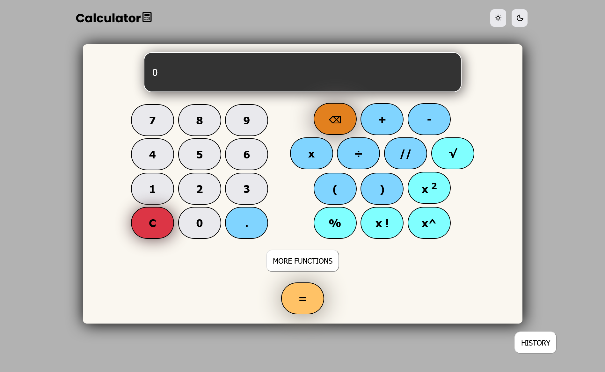

# Calculator

[](https://discord.com/invite/Yn9g6KuWyA)
[](https://www.youtube.com/@dhanushnehru?sub_confirmation=1)
[](https://dhanushn.substack.com/)

A Calculator that performs many **mathematical** functions


## Features

```
- Add
- Multiply
- Subtract
- Divide
- Square
- Square Root
- Power of n
- Natural exponential function
- Factorial of n
- Trigonometric operation
- Cuberoot
-nPr[Permutation of n elments]
-nCr[Number of combinations for given set]
```

## Gitpod

In the cloud-free development environment where you can directly start coding.

The below command will open up the index.html in a browser in gitpod 
`python -m http.server 8000`

You can use Gitpod in the cloud [](https://gitpod.io/#https://github.com/DhanushNehru/calculator/)

## Tech Stack


- HTML
- CSS
- JAVASCRIPT

## Deployment

To deploy the project locally
> You need to clone the project and Run the **HTML** file.

## Screenshot

>Interface of the **Calculator**



</br>

If you liked this project support it by starring it 🌟 and share it on social media
